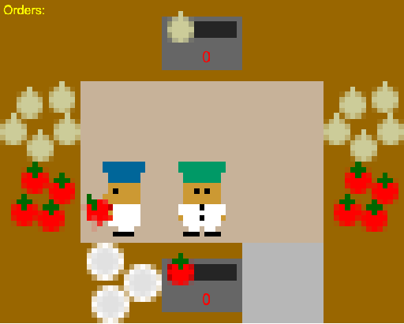

<p align="center">

</p>
  


# Overcooked-AI

TODO: Change REPO_NAME

## Installation

When cloning the repo, make sure you also clone the submodules.

```
git clone --recurse-submodules -j8 git@github.com:HumanCompatibleAI/overcooked_ai.git
```

It is useful to setup a conda environment with Python 3.7:

```
conda create -n overcooked_ai python=3.7
conda activate overcooked_ai
```

To complete the installation, run the following commands:

```
cd overcooked_ai
pip setup.py develop
pip install -r requirements.txt
```

## Verify Installation

To verify your installation, you can try running the following command from the inner `REPO_NAME` folder (with flag `-f` for a quick run, and without for a more comprehensive suite that will take approximately 5/10 minutes to run):

```
python run_tests.py -f
```

## Python Repo Structure Overview

`mdp/`:
- `overcooked_mdp.py`: main Overcooked game logic
- `overcooked_env.py`: environment classes built on top of the Overcooked mdp
- `overcooked_interactive.py`: script to play Overcooked in terminal against trained agents
- `layout_generator.py`: functions to generate random layouts programmatically

`agents/`:
- `agent.py`: where agent types are defined
- `benchmarking.py`: sample trajectories of agents (both trained and planners) and load various models

`planning`:
- `planners.py`: near-optimal agent planning logic
- `search.py`: A* search and shortest path logic

`run_tests.py`: script to run all tests

# Javascript Visualizations

In `REPO_NAME` there is a javascript implementation of the Overcooked MDP and game visualizer.

## Visualization Demo
To run a simple demo that plays a trajectory demonstrating the
transitions in the game:
```
$ open http://localhost:8123/demo.html; python2.7 -m SimpleHTTPServer 8123
```

Or if you have npm installed (recommended):
```
$ npm run demo
```

## Development
Set up the package with `npm install`.

Run tests with `npm run test`. Testing scripts use `jest`, which exposes a `window` object, and so
`npm run build-window` should be run before running modified tests.

`overcooked-window.js` is used for the demo and testing.
