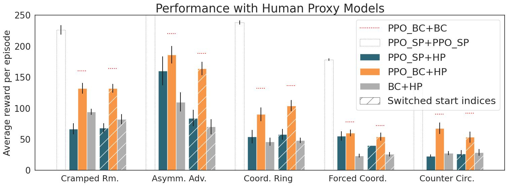

# Human-Aware Reinforcement Learning

This code is based on the work in [On the Utility of Learning about Humans for Human-AI Coordination](https://arxiv.org/abs/1910.05789). 

# Contents

To play the game with trained agents, you can use [Overcooked-Demo](https://github.com/HumanCompatibleAI/overcooked-demo).

For more information about the Overcooked-AI environment, check out [this](https://github.com/HumanCompatibleAI/overcooked_ai) repo.

* [Testing](#testing)
* [Repo Structure Overview](#repo-structure-overview)
* [Usage](#usage)
* [Troubleshooting](#troubleshooting)
# Testing

If set-up was successful, all unit tests and local reproducibility tests should pass. They can be run as follows

```bash
$ ./run_tests.sh
```

**Be sure to change your CWD to the human_aware_rl directory before running the script, 
as the test script uses the CWD to dynamically generate a path to save temporary training runs/checkpoints. 
The testing script will fail if not being run from the correct directory.**

To run individual tests, checkout the following commands (individual tests with the  `-m unittest` flag can be run from any directory):

## PPO Tests
Highest level integration tests that combine self play, bc training, and ppo_bc training
```bash
(harl_rllib) $ cd human_aware_rl/ppo
(harl_rllib) human_aware_rl/ppo $ python ppo_rllib_test.py
```
or 
```bash
(harl_rllib) $ python -m unittest human_aware_rl.ppo.ppo_rllib_test
```

## BC Tests
All tests involving creation, training, and saving of bc models. No dependency on rllib
There are 2 test classes depending on whether the model is trained with LSTM, the run_tests.sh file by default only tests model without LSTM 
```bash
(harl_rllib) $ cd imitation
(harl_rllib) imitation $ python behavior_cloning_tf2_test.py TestBCTraining
```
or 
```bash
(harl_rllib) $ python -m unittest human_aware_rl.imitation.behavior_cloning_tf2_test.TestBCTraining
```
## Rllib Tests
Tests rllib environments and models, as well as various utility functions. Does not actually test rllib training
```bash
(harl_rllib) $ cd rllib
(harl_rllib) rllib $ python tests.py
```
or 
```bash
(harl_rllib) $ python -m unittest human_aware_rl.rllib.tests
```

You should see all tests passing. 

Note: the tests are broken up into separate files because they rely on different tensorflow execution states (i.e. the bc tests run tf in eager mode, while rllib requires tensorflow to be running symbollically). Going forward, it would probably be best to standardize the tensorflow execution state, or re-write the code such that it is robust to execution state.

## Training examples

You can also try to train agents for 5 classical layouts

```bash
(harl_rllib) $ cd ppo
(harl_rllib) ppo $ bash run_experiments.sh
```

Please choose the `num_workers` parameters to be less than the number of CPUs on your machine. For more information
check the ray [documentation](https://docs.ray.io/en/latest/rllib/rllib-training.html)

## Experiments results

This graph shows the performance of reproduced agents in a similar style as the original ones in the Neurips 2019 paper.



It was created with the reproduced agents from running `run_experiments.sh` and `run_ppo_bc_experiments.sh`.

The evaluation and plotting code can be found under the `human_aware_rl/ppo` directory.


# Repo Structure Overview

`ppo/`:
- `ppo_rllib.py`: Primary module where code for training a PPO agent resides. This includes an rllib compatible wrapper on `OvercookedEnv`, utilities for converting rllib `Policy` classes to Overcooked `Agent`s, as well as utility functions and callbacks
- `ppo_rllib_client.py` Driver code for configuing and launching the training of an agent. More details about usage below
- `ppo_rllib_from_params_client.py`: train one agent with PPO in Overcooked with variable-MDPs 
- `ppo_rllib_test.py` Reproducibility tests for local sanity checks
- `run_experiments.sh` Script for training agents on 5 classical layouts
- `trained_example/` Pretrained model for testing purposes


`rllib/`:
- `rllib.py`: rllib agent and training utils that utilize Overcooked APIs
- `utils.py`: utils for the above
- `tests.py`: preliminary tests for the above

`imitation/`:
- `behavior_cloning_tf2.py`:  Module for training, saving, and loading a BC model
- `behavior_cloning_tf2_test.py`: Contains basic reproducibility tests as well as unit tests for the various components of the bc module.

`human/`:
- `process_data.py` script to process human data in specific formats to be used by DRL algorithms
- `data_processing_utils.py` utils for the above

`utils.py`: utils for the repo

# Usage

Before proceeding, it is important to note that there are two primary groups of hyperparameter defaults, `local` and `production`. Which is selected is controlled by the `RUN_ENV` environment variable, which defaults to `production`. In order to use local hyperparameters, run
```bash
$ export RUN_ENV=local
```

Training of agents is done through the `ppo_rllib_client.py` script. It has the following usage:

```bash
 ppo_rllib_client.py [with [<param_0>=<argument_0>] ... ]
```

For example, the following snippet trains a self play ppo agent on seed 1, 2, and 3, with learning rate `1e-3`, on the `"cramped_room"` layout for `5` iterations without using any gpus. The rest of the parameters are left to their defaults
```
(harl_rllib) ppo $ python ppo_rllib_client.py with seeds="[1, 2, 3] lr=1e-3 layout_name=cramped_room num_training_iters=5 num_gpus=0 experiment_name="my_agent"
```

For a complete list of all hyperparameters as well as their local and production defaults, refer to the `my_config` section of  `ppo_rllib_client.py`


Training results and checkpoints are stored in a directory called `~/ray_results/my_agent_<seed>_<timestamp>`. You can visualize the results using tensorboard
```bash
(harl_rllib) $ cd ~/ray_results
(harl_rllib) ray_results $ tensorboard --logdir .
```

You can also visualize the results with [wandb](https://wandb.ai/site). Follow [the official instructions](https://docs.wandb.ai/quickstart) to setup your own account. 
If `verbose=True`(which is true by default when running experiments), then the training results will be logged to wandb server. 


# Troubleshooting

## Tensorflow
Many tensorflow errors are caused by the tensorflow state of execution. For example, if you get an error similar to 

```
ValueError: Could not find matching function to call loaded from the SavedModel. Got:
  Positional arguments (1 total):
    * Tensor("inputs:0", shape=(1, 62), dtype=float64)
  Keyword arguments: {}
```

or

```
NotImplementedError: Cannot convert a symbolic Tensor (model_1/logits/BiasAdd:0) to a numpy array.
```

or

```
TypeError: Variable is unhashable. Instead, use tensor.ref() as the key.
```

It is likely because the code you are running relies on tensorflow executing symbolically (or eagerly) and it is executing eagerly (or symbolically)

This can be fixed by either changing the order of imports. This is because `import tensorflow as tf` sets eager execution to true, while any `rllib` import disables eager execution. Once the execution state has been set, it cannot be changed. For example, if you require eager execution, make sure `import tensorflow as tf` comes BEFORE `from ray import rllib` and vise versa.
