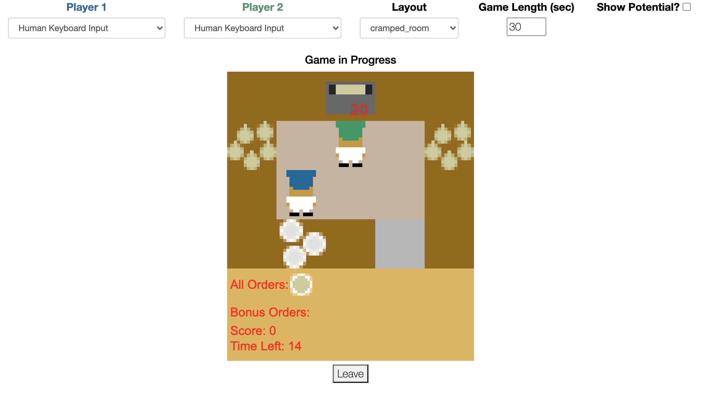

# Overcooked Demo
<p align="center">

</p>

A web application where humans can play Overcooked with trained AI agents.

* [Installation](#installation)
* [Usage](#usage)
* [Dependencies](#dependencies)
* [Using Pre-trained Agents](#using-pre-trained-agents)
* [Updating](#updating)
* [Configuration](#configuration)
* [Legacy Code](#legacy-code)

## Installation

Building the server image requires [Docker](https://docs.docker.com/get-docker/)

## Usage

The server can be deployed locally using the driver script included in the repo. To run the production server, use the command
```bash
./up.sh production
```

In order to build and run the development server, which includes a deterministic scheduler and helpful debugging logs, run
```bash
./up.sh
```

After running one of the above commands, navigate to http://localhost

In order to kill the production server, run
```bash
./down.sh
```

You can also start the server via the command line. After installing the `overcooked_ai` via pip, you can start the server by typing

```
overcooked-demo-up
```

in the terminal. The same arguments still apply

## Dependencies

The Overcooked-Demo server relies on the [overcooked-ai](https://github.com/HumanCompatibleAI/overcooked_ai) repo, specifically the submodules overcooked_ai_py and human_aware_rl. Changes made in these modules will be reflected in the overcooked_demo server.

One thing to note is that local changes to the game logic will not be present by default in the demo (it is pulled directly from the GitHub version). Only changes made in the overcooked_demo folder locally will be reflected in the demo.

## Using Pre-trained Agents

Overcooked-Demo can dynamically load pre-trained agents provided by the user. In order to use a pre-trained agent, a pickle file should be added to the `agents` directory. The final structure will look like `static/assets/agents/<agent_name>/agent.pickle`. Note, to use the pre-defined rllib loading routine, the agent directory name must start with 'rllib', and contain the appropriate rllib checkpoint, config, and metadata files. Details can be found in the [README](server/static/assets/agents/README.md) under the agent directory. We also provide a [move_agents.py](server/move_agents.py) file that can help copy over checkpoint files.

The existing agents that are available to play with in the overcooked_demo module are taken from [this group](https://drive.google.com/drive/folders/1CI3rLZg5wpjpoTDBi1M1qn8xvjqhk5Md?usp=share_link) of reproduced agents. To reproduce the results locally, you can run [this script](https://github.com/HumanCompatibleAI/overcooked_ai/blob/master/src/human_aware_rl/ppo/run_experiments.sh). 

If a more complex or custom loading routing is necessary, one can subclass the `OvercookedGame` class and override the `get_policy` method, as done in [DummyOvercookedGame](server/game.py#L420). Make sure the subclass is properly imported [here](server/app.py#L5)


## Use the human vs. human game mode.

### 1): Using Docker Compose CLI to deploy on EC2
With the Overcooked demo, you can test the interaction between two human players. To do this, you need to deploy this code on a server (https://docs.docker.com/language/python/deploy/). 
After successful deployment, the first user (User 1) should go to http://[server_ip_address]/, select the human keyboard input for both players, and select the setting for this game (e.g. whether to collect data and/or to run the game with new dynamics, which means the soup requires an additional "interact" action to start cooking), and click "Create game". If everything has been successful, he will receive a message: "Waiting for game to start". 

Another user (User 2) should open the same page, and click "Join Existing Game". If there are multiple existing games, this will pair User 2 with the game that was created first. 

Note that if there are existing games, the settings User 2 chooses have no influence on the game. If there is no existing game, clicking "Join Existing Game" will create a game with the settings selected and place the user in a waiting room.

If you want to run a test on a local computer, you should use "localhost" instead of "server_ip_address" and open the corresponding links in different tabs.

### 2): Setup the repo on a cloud server 
One also has the option to setup the repo again on a cloud server. This allows more flexible customization and easier spin-up. The following steps demonstrate how one can steup the repo on an AWS EC2 instance 

1: Get an [AWS account](https://aws.amazon.com/free/). Note that any cloud provider should work – the instructions provided here for AWS are only meant as an example.

2: Sign in to the management console to start an EC2 instance. Choose your instance type according to your expected load. 

3: Install git on the server by running (example here is for linux instance)

```bash
sudo yum update
sudo yum install git
```
4: Install pip [on the instance](https://docs.aws.amazon.com/elasticbeanstalk/latest/dg/eb-cli3-install-linux.html)

5: Clone the repo and do a regular pip install. You can also [optionally get Anaconda on the server](https://medium.com/@GalarnykMichael/aws-ec2-part-3-installing-anaconda-on-ec2-linux-ubuntu-dbef0835818a).

6: Spin up the server like usual by calling 

```
overcooked-demo-up
```

7: Once the server is up, you can access the game through your browser by passing in the public ip of your server and port 80.

### 3): Running predefined experiments

One can also define a series of experiments to be run when players join the game. To do that, go to [`config.json`](./server/config.json) and modify the "predefined" parameters by changing what the layouts you want to include and the settings for them. 

Save the changes and spin up a server by ways described in the earlier sections. User 1 should go to http://[server_ip_address]/predefined, where they should be placed in a waiting room, and they will see how many layouts are there in the current series of experiments. User 2 can now go to http://[server_ip_address]/predefined, and the game should automatically start. The games will be run back to back until it goes through all the predefined layouts in the config file.

Note if a participant wants to leave the waiting room, use the "leave" button instead of closing the tab when possible. The leave button handles closing the room more gracefully, and without it the server sometimes doesn't detect the disconnection in time, thus can lead to pairing of new players with old players that are no longer in the waiting room. In general closing the tab in the middle of a game can lead to unpredictable behaviors so it is discouraged. 


## Updating
Changes to the JSON state representation of the game will require updating the JS graphics. At the highest level, a graphics implementation must implement the functions `graphics_start`, called at the start of each game, `graphics_end`, called at the end of each game, and `drawState`, called at every timestep tick. See [dummy_graphcis.js](server/graphics/dummy_graphics.js) for a barebones example.

The graphics file is dynamically loaded into the docker container and served to the client. Which file is loaded is determined by the `GRAPHICS` environment variable. For example, to server `dummy_graphics.js` one would run
```bash
GRAPHICS=dummy_graphics.js ./up.sh
```
The default graphics file is currently `overcooked_graphics_v2.1.js`


## Configuration

Basic game settings can be configured by changing the values in [config.json](server/config.json)

## Legacy Code

For legacy code compatible with the Neurips2019 submission please see [this](https://github.com/HumanCompatibleAI/overcooked-demo/tree/legacy) branch of this repo. 
